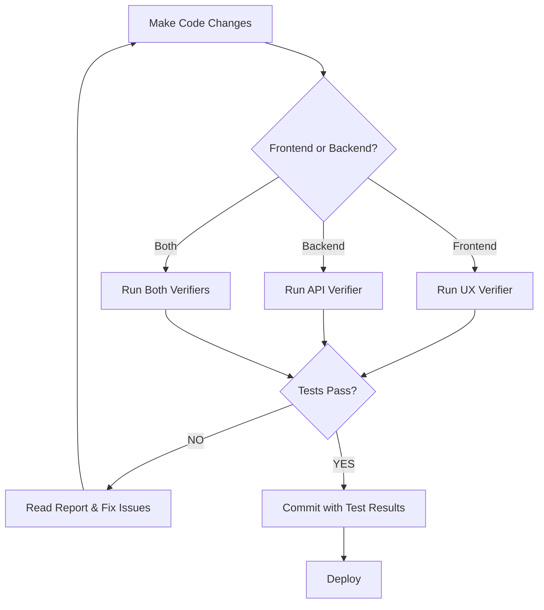

# Verification System Setup - Summary

## ✅ What Was Created

This document summarizes the verification system setup for the Spanish Learning App.

### 📁 Agent Configuration Files

1. **`.claude/agents/ux-verifier.md`**
   - Role: Frontend Quality Assurance
   - Tools: Playwright MCP, Axe Core
   - Validates:
     - WhatsApp-style chat layout
     - Push-to-talk audio behavior
     - WCAG 2.1 AA accessibility
     - Responsive design (800px max-width)

2. **`.claude/agents/api-verifier.md`**
   - Role: Backend Quality Assurance
   - Tools: AJV, OpenAPI 3.1
   - Validates:
     - API contract compliance (swagger.json)
     - All endpoints (/, /api/health, /api/translate)
     - Error handling (422, 500)
     - Security (XSS, SQL injection)

### 📋 Project Instructions

**`.claude/project_instructions.md`**
- Comprehensive guide for when to invoke each agent
- Detailed error handling matrix
- Workflow diagrams for full-stack changes
- Report artifact management
- CI/CD integration examples

### 🧪 Test Implementations

**`tests/ui/ux-verification.spec.ts`**
Implements all UX Verifier test phases:
- Phase 1: Environment verification
- Phase 2: Layout tests (WhatsApp style)
- Phase 3: Push-to-talk audio tests
- Phase 4: Accessibility audit

**`tests/api/contract.spec.ts`** (already existed)
- API contract validation with AJV
- OpenAPI schema compliance
- Error response validation

### 🚀 NPM Scripts

Added to `package.json`:
```json
{
  "verify:ux": "playwright test tests/ui/ux-verification.spec.ts --reporter=list",
  "verify:api": "playwright test tests/api/contract.spec.ts --reporter=list",
  "verify:all": "npm run verify:api && npm run verify:ux"
}
```

### 📊 Reports Directory

**`reports/`**
- `reports/ux/` - UX verification reports
- `reports/api/` - API verification reports
- `reports/README.md` - Report documentation

### 📖 Documentation Updates

1. **`CLAUDE.md`** - Updated with agent references
2. **`tests/README.md`** - Added verification agent section
3. **`.gitignore`** - Excludes test reports (except READMEs)

## 🔧 How to Use

### Quick Start

```bash
# Install dependencies (if not already done)
npm install
npx playwright install chromium

# Run UX verification
npm run verify:ux

# Run API verification
npm run verify:api

# Run all verifications
npm run verify:all
```

### When to Run Verifications

**Automatically invoke UX Verifier when:**
- Changes to `public/audio-control.js`
- Changes to `app.py` (UI section)
- Changes to `.chainlit/config.toml`
- CSS or styling updates
- Before deployment

**Automatically invoke API Verifier when:**
- Changes to `main.py`, `services.py`, `database.py`
- Changes to `docs/swagger.json`
- New API endpoints added
- Before deployment

### Reading Reports

**UX Verifier Reports:**
```
✅ Phase 1: Environment - PASS
✅ Phase 2: Layout - PASS
✅ Phase 3: Audio Behavior - PASS
✅ Phase 4: Accessibility - PASS
```

**API Verifier Reports:**
```
✅ Phase 1: Environment - PASS
✅ Phase 3: Endpoint Tests (6/6 passed)
✅ Phase 4: Schema Compliance - PASS
✅ Phase 5: Security & Edge Cases - PASS
```

### Handling Failures

If verification fails:

1. **Read the "FIX:" sections** in the report
2. **Apply suggested code changes** to the specified files
3. **Re-run verification** until all tests pass
4. **DO NOT COMMIT** until all verifications pass

Example failure handling:
```
❌ UX Test Failed: Container max-width is 1200px (expected 800px)

FIX: Update CSS in app.py:
.chat-container { max-width: 800px; }

Actions:
1. Open app.py
2. Find .chat-container class
3. Change max-width: 1200px → 800px
4. Re-run: npm run verify:ux
5. Commit when ✅ PASS
```

## 🎯 Success Criteria

### UX Verifier Must Pass:
- ✅ Chat container: 800px max-width, centered
- ✅ User messages: right-aligned (green/blue)
- ✅ Assistant messages: left-aligned (gray)
- ✅ Push-to-talk: no auto-send on silence
- ✅ Zero critical accessibility violations

### API Verifier Must Pass:
- ✅ All endpoints return correct status codes
- ✅ All responses match OpenAPI schema
- ✅ Error responses follow HTTPValidationError schema
- ✅ No critical security vulnerabilities

## 📂 File Structure

```
speak_spanish_chainlink/
├── .claude/
│   ├── agents/
│   │   ├── ux-verifier.md              # UX verification agent
│   │   ├── api-verifier.md             # API verification agent
│   │   └── VERIFICATION_SETUP.md       # This file
│   ├── project_instructions.md         # Main verification guide
│   └── settings.local.json
├── tests/
│   ├── api/
│   │   ├── contract.spec.ts            # API contract tests
│   │   └── smoke.spec.ts
│   ├── ui/
│   │   ├── accessibility.spec.ts       # Accessibility tests
│   │   └── ux-verification.spec.ts     # UX verification tests
│   └── README.md
├── reports/
│   ├── ux/                             # UX test reports
│   ├── api/                            # API test reports
│   └── README.md                       # Report documentation
├── docs/
│   └── swagger.json                    # OpenAPI schema (source of truth)
├── package.json                        # NPM scripts
├── playwright.config.ts
├── CLAUDE.md                           # Project guidelines (updated)
└── .gitignore                          # Excludes test reports
```

## 🔄 Workflow Integration

### Development Workflow



### Pre-Deployment Checklist

- [ ] Run `npm run verify:all`
- [ ] All UX tests pass (✅)
- [ ] All API tests pass (✅)
- [ ] No critical accessibility violations
- [ ] No security vulnerabilities detected
- [ ] Reports reviewed and saved
- [ ] Commit message includes test results

### Example Commit Message

```
feat: Add pronunciation feedback endpoint

✅ API Verifier: PASS (8/8 tests)
  - New endpoint: GET /api/pronunciation
  - Schema compliance: PASS
  - Error handling: PASS

✅ UX Verifier: PASS (all phases)
  - Layout: PASS
  - Accessibility: 0 violations
  - Push-to-talk: PASS

Report: reports/api/report-20260120-143022.txt
```

## 🐛 Troubleshooting

### "Playwright browsers not installed"
```bash
npx playwright install chromium
```

### "Chainlit not running on port 8001"
```bash
chainlit run app.py --port 8001
```

### "FastAPI server not running"
```bash
uvicorn main:app --reload --port 8000
```

### "swagger.json outdated"
```bash
python scripts/extract_openapi.py
```

### "Environment misconfigured"
```bash
python verify_setup.py
# Follow error messages to fix dependencies
```

## 📚 Further Reading

- **UX Verifier Details:** `.claude/agents/ux-verifier.md`
- **API Verifier Details:** `.claude/agents/api-verifier.md`
- **Verification Workflows:** `.claude/project_instructions.md`
- **Test Documentation:** `tests/README.md`
- **Report Examples:** `reports/README.md`

## 🎓 Best Practices

1. **Run verifiers before every commit**
2. **Never deploy if verifiers fail**
3. **Always commit test results in commit message**
4. **Fix suggested issues immediately (don't defer)**
5. **Re-run verifiers after applying fixes**
6. **Keep reports from production deployments**
7. **Update agent specs if new patterns emerge**

## 🔐 Security

Both verifiers include security checks:

**UX Verifier:**
- XSS prevention (input sanitization)
- WCAG 2.1 AA compliance (protects users with disabilities)

**API Verifier:**
- SQL injection testing
- XSS attempt handling
- Large payload rejection (DoS prevention)
- Rate limiting verification (if implemented)

## 📈 Metrics & KPIs

Track these metrics from verification reports:

- **Pass Rate:** % of verifications that pass on first run
- **Accessibility Score:** Number of WCAG violations (goal: 0)
- **API Coverage:** % of endpoints with contract tests (goal: 100%)
- **Security Score:** Number of vulnerabilities detected (goal: 0)

## 🚦 Deployment Gates

**Production deployments BLOCKED if:**
- ❌ UX Verifier fails any critical test
- ❌ API Verifier fails any endpoint test
- ❌ Critical accessibility violations detected
- ❌ Security vulnerabilities found

**Production deployments ALLOWED with WARNING if:**
- ⚠️  MongoDB unavailable (caching disabled)
- ⚠️  Minor accessibility issues (WCAG A only)

## 🎉 Success!

You now have a complete verification system with:
- ✅ Automated UX testing (Playwright + Axe Core)
- ✅ Automated API testing (AJV + OpenAPI)
- ✅ Clear agent specifications
- ✅ Comprehensive documentation
- ✅ CI/CD-ready infrastructure

**Next Steps:**
1. Run `npm run verify:all` to test the system
2. Review generated reports in `reports/`
3. Integrate into your CI/CD pipeline
4. Train your team on the verification workflow

---

**Questions?** See `.claude/project_instructions.md` for detailed workflows and troubleshooting.
