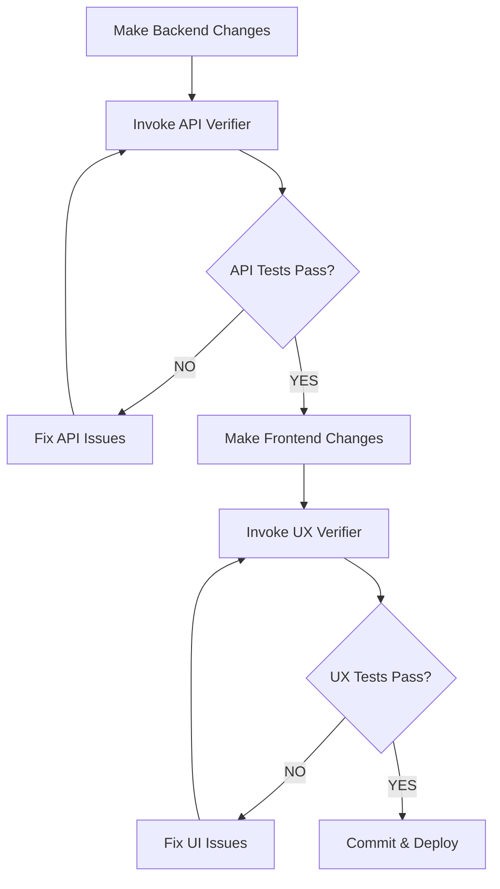
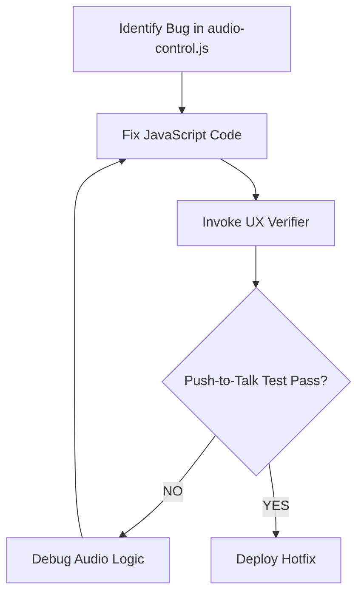

# Project Development Instructions

## Overview
This document defines when and how to invoke verification agents, and what to do with their reports.

## Architecture
- **Frontend:** Chainlit 2.9.5 (Python 3.13) with custom JavaScript for push-to-talk
- **Backend:** FastAPI with MongoDB caching, DeepL translation, ElevenLabs TTS
- **Testing:** Playwright + Axe Core (UX), AJV + OpenAPI schema (API)

## Verification Agents

### 1. UX Verifier Agent
**Location:** `.claude/agents/ux-verifier.md`
**Purpose:** Frontend UI/UX validation with Playwright and Axe Core

#### Trigger Conditions (When to Invoke)
Automatically invoke UX Verifier when:

1. **Audio Control Changes:**
   - Any edit to `public/audio-control.js`
   - Changes to `.chainlit/config.toml` affecting `[features.audio]`
   - EngineIO settings modified in `app.py`

2. **UI/Layout Changes:**
   - Changes to `app.py` (UI section)
   - CSS modifications or custom styling
   - Chat layout structure changes

3. **User Reports:**
   - User complains about audio auto-submitting
   - UI alignment issues (messages not WhatsApp-style)
   - Accessibility concerns

4. **Pre-Deployment:**
   - Before merging to main branch
   - Before production deployment
   - After major UI refactoring

#### Invocation Command
```bash
# Run UX verification tests
npx playwright test tests/ux-verification.spec.ts --headed

# Or invoke via Claude agent
/invoke ux-verifier
```

#### What to Do with UX Verifier Reports

**If Report Shows ✅ PASS:**
1. Commit changes with message referencing UX verification
2. Update `TESTING.md` with test results timestamp
3. Proceed to API verification (if backend changes made)
4. Safe to deploy

**If Report Shows ❌ FAIL:**
1. **DO NOT COMMIT** the failing changes
2. Read the "FIX:" sections in the report
3. Apply suggested fixes to the specified files
4. Re-run UX Verifier until all tests pass
5. Document the fix in commit message

**Example Failure Response:**
```
❌ UX Test Failed: Container max-width is 1200px (expected 800px)

Actions:
1. Open app.py or custom CSS file
2. Find .chat-container class
3. Change max-width: 1200px → max-width: 800px
4. Re-run: /invoke ux-verifier
5. Commit when ✅ PASS
```

**Critical Failures (Block Deployment):**
- Push-to-talk not working (auto-send on silence)
- Message alignment wrong (user/assistant reversed)
- Critical accessibility violations (WCAG 2.1 AA)

---

### 2. API Verifier Agent
**Location:** `.claude/agents/api-verifier.md`
**Purpose:** Backend API contract validation with AJV and OpenAPI schema

#### Trigger Conditions (When to Invoke)
Automatically invoke API Verifier when:

1. **API Endpoint Changes:**
   - Modifications to `main.py`, `app.py` (FastAPI routes)
   - Changes to `services.py` (business logic)
   - Database schema changes in `database.py`

2. **OpenAPI Schema Updates:**
   - Any edit to `docs/swagger.json`
   - New endpoints added
   - Response schema modifications

3. **Dependency Updates:**
   - DeepL API integration changes
   - MongoDB client updates
   - Error handling modifications

4. **User Reports:**
   - API returning incorrect data
   - Unexpected error responses
   - Translation failures

5. **Pre-Deployment:**
   - Before merging to main branch
   - Before production deployment
   - After backend refactoring

#### Invocation Command
```bash
# Run API verification tests
node tests/api-verification.js

# Or invoke via Claude agent
/invoke api-verifier
```

#### What to Do with API Verifier Reports

**If Report Shows ✅ PASS:**
1. Commit changes with message referencing API verification
2. Update OpenAPI docs if endpoints changed
3. Regenerate `swagger.json` if needed: `python scripts/extract_openapi.py`
4. Safe to deploy

**If Report Shows ❌ FAIL:**
1. **DO NOT DEPLOY** the failing API
2. Read the "FIX:" sections in the report
3. Apply suggested code fixes to the specified files
4. Re-run API Verifier until all tests pass
5. Update `docs/swagger.json` if schema changed

**Example Failure Response:**
```
❌ API Test Failed: GET /api/translate missing field "target_lang"

Actions:
1. Open services.py
2. Find translate() function
3. Add to return dict: "target_lang": target_lang
4. Re-run: /invoke api-verifier
5. Update swagger.json if needed
6. Commit when ✅ PASS
```

**Critical Failures (Block Deployment):**
- 500 errors on valid requests
- Missing required fields in responses
- Security vulnerabilities (XSS, SQL injection)
- Schema validation errors

---

## Combined Verification Workflow

### Scenario 1: Full-Stack Feature Addition
**Example:** Adding a new "pronunciation feedback" endpoint



**Steps:**
1. Add endpoint to `main.py`, update `services.py`
2. Run: `/invoke api-verifier`
3. Fix any API contract violations
4. Update UI in `app.py` to call new endpoint
5. Run: `/invoke ux-verifier`
6. Fix any UI/accessibility issues
7. Commit with both verification passes referenced

### Scenario 2: Hotfix for Audio Bug
**Example:** Audio auto-submitting on silence



**Steps:**
1. Edit `public/audio-control.js`
2. Run: `/invoke ux-verifier` (focus on Phase 3: Audio Tests)
3. Fix until "Test 3.3: No Auto-Send on Silence" passes
4. Deploy immediately (critical UX bug)

### Scenario 3: Pre-Deployment Checklist

Before any production deployment, run BOTH verifiers:

```bash
# 1. Run API verification
node tests/api-verification.js > reports/api-$(date +%Y%m%d).txt

# 2. Run UX verification
npx playwright test tests/ux-verification.spec.ts > reports/ux-$(date +%Y%m%d).txt

# 3. Check reports
cat reports/api-*.txt | grep "PASS" && cat reports/ux-*.txt | grep "PASS"
```

**Deployment Gate Rules:**
- ❌ If EITHER verifier fails → DO NOT DEPLOY
- ⚠️  If MongoDB unavailable (API Verifier warning) → OK to deploy (caching disabled)
- ✅ If BOTH pass → SAFE TO DEPLOY

---

## Error Report Handling Matrix

| Error Type | Agent | Severity | Action | Block Deploy? |
|------------|-------|----------|--------|---------------|
| Push-to-talk not working | UX Verifier | 🔴 CRITICAL | Fix `audio-control.js` immediately | YES |
| Message alignment wrong | UX Verifier | 🟠 HIGH | Fix CSS in `app.py` | YES |
| Accessibility violation | UX Verifier | 🟡 MEDIUM | Fix aria-labels, contrast | MAYBE |
| API 500 error | API Verifier | 🔴 CRITICAL | Fix error handling in `services.py` | YES |
| Missing response field | API Verifier | 🟠 HIGH | Update return dict in endpoint | YES |
| Schema type mismatch | API Verifier | 🟠 HIGH | Fix data types in response | YES |
| XSS vulnerability | API Verifier | 🔴 CRITICAL | Sanitize input immediately | YES |
| MongoDB unavailable | API Verifier | 🟢 LOW | Warning only (caching disabled) | NO |

**Severity Definitions:**
- 🔴 **CRITICAL:** Breaks core functionality, security risk, or data integrity issue
- 🟠 **HIGH:** Feature doesn't work as expected, contract violation
- 🟡 **MEDIUM:** UX degradation, minor accessibility issues
- 🟢 **LOW:** Optional dependency unavailable, performance warning

---

## Report Artifact Management

### Storing Test Reports
```bash
# Create reports directory if not exists
mkdir -p reports/ux reports/api

# Save UX reports with timestamp
npx playwright test --reporter=html > reports/ux/report-$(date +%Y%m%d-%H%M%S).html

# Save API reports with timestamp
node tests/api-verification.js > reports/api/report-$(date +%Y%m%d-%H%M%S).txt
```

### Committing Test Results
```bash
# Good commit message format
git commit -m "feat: Add pronunciation endpoint

✅ API Verifier: PASS (6/6 tests)
✅ UX Verifier: PASS (all phases)
✅ Accessibility: 0 violations
"
```

### CI/CD Integration (Future)
```yaml
# .github/workflows/verify.yml
name: Verification Suite
on: [push, pull_request]
jobs:
  api-verification:
    runs-on: ubuntu-latest
    steps:
      - uses: actions/checkout@v3
      - run: npm install
      - run: node tests/api-verification.js

  ux-verification:
    runs-on: ubuntu-latest
    steps:
      - uses: actions/checkout@v3
      - run: npx playwright install
      - run: npx playwright test tests/ux-verification.spec.ts
```

---

## Agent Invocation Priority

When multiple issues exist, invoke agents in this order:

1. **Guardian Agent** (if environment issues)
   - Checks Python version, dependencies, config files
   - Must pass before other agents can run

2. **API Verifier** (backend first)
   - Ensures backend contract is correct
   - No point testing UI if API is broken

3. **UX Verifier** (frontend second)
   - Tests UI against working backend
   - Verifies end-to-end user experience

4. **Audio Expert** (if audio-specific issues)
   - Deep dive into `audio-control.js` logic
   - Only after UX Verifier identifies audio failure

5. **Tutor Architect** (if content/personality issues)
   - Reviews LLM prompts, personality
   - Not a verification agent, but can be invoked for content QA

---

## Quick Reference Commands

```bash
# Run all verifications (sequential)
npm run verify:all

# Run only UX tests
npm run verify:ux

# Run only API tests
npm run verify:api

# Generate fresh OpenAPI schema
python scripts/extract_openapi.py

# Check environment setup
python verify_setup.py
```

## Troubleshooting Common Issues

### UX Verifier Won't Start
```bash
# Issue: Playwright browsers not installed
# Fix:
npx playwright install

# Issue: Chainlit not running
# Fix:
chainlit run app.py --port 8000
```

### API Verifier Fails Immediately
```bash
# Issue: FastAPI server not running
# Fix:
uvicorn main:app --reload --port 8000

# Issue: swagger.json outdated
# Fix:
python scripts/extract_openapi.py
```

### Both Verifiers Fail
```bash
# Issue: Environment misconfigured
# Fix:
python verify_setup.py
# Follow the error messages to fix dependencies
```

---

## Summary

**Golden Rules:**
1. ✅ ALWAYS run verifiers before merging to main
2. ❌ NEVER deploy if either verifier fails
3. 📝 ALWAYS commit test results in commit message
4. 🔧 FIX suggested issues immediately (don't defer)
5. 🔄 RE-RUN verifiers after applying fixes

**Agent Responsibilities:**
- **UX Verifier:** UI/UX, accessibility, push-to-talk behavior
- **API Verifier:** API contracts, schema compliance, error handling

**Success Metric:**
- Production deployments MUST have 100% verifier pass rate
- Zero critical/high severity issues in reports
